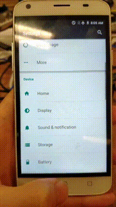

# LeaveHomeCompanion
A simple launcher app that launches LeaveHomeSafe by GovHK

# What it does
It simply opens LeaveHomeSafe if installed. This is packaged as an Android Launcher/ Home Screen app, so you only have to set it as your default "Home" app for it to work.

With this app, you can make your dedicated LeaveHomeSafe device launch LeaveHomeSafe whenever you press home or back

# How to install
Go to the [release page](https://github.com/h9419/leavehomecompanion/releases) to download the apk, install it, then choose "Always" the next time you press the home button. 

On some phones such as the Pixel, the option is not always shown. In that case, search "Default home app" in settings and choose the leavehomecompanion app

# How to uninstall
To uninstall the app, pull down the notification center/ quick settings and open settings. Then go to Applications, find the app "leavehomecompanion" and uninstall it. Your phone will default back to your previous launcher afterwards.